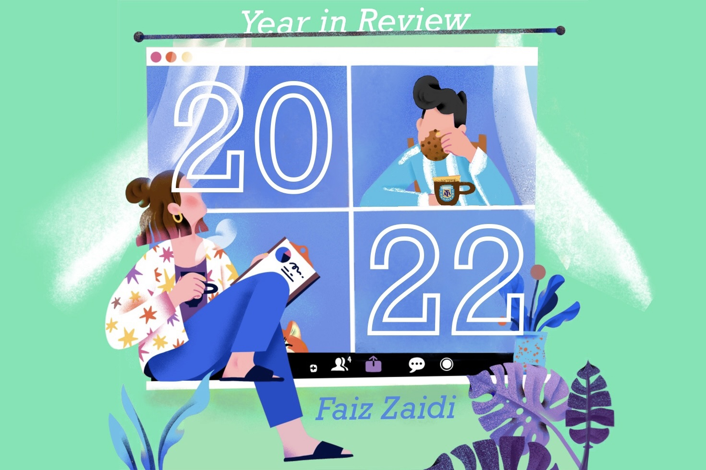
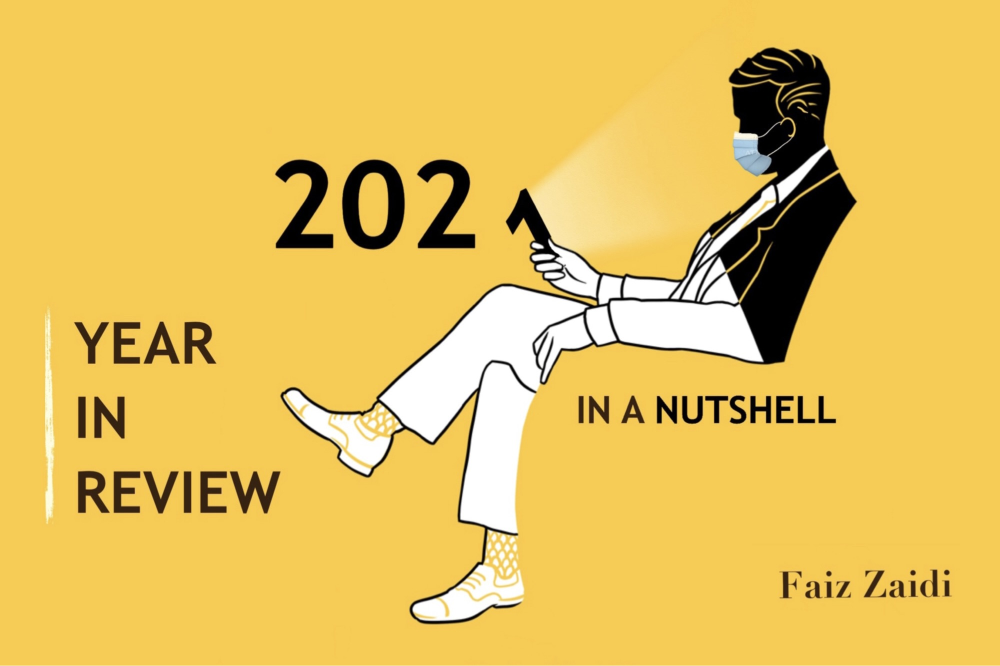
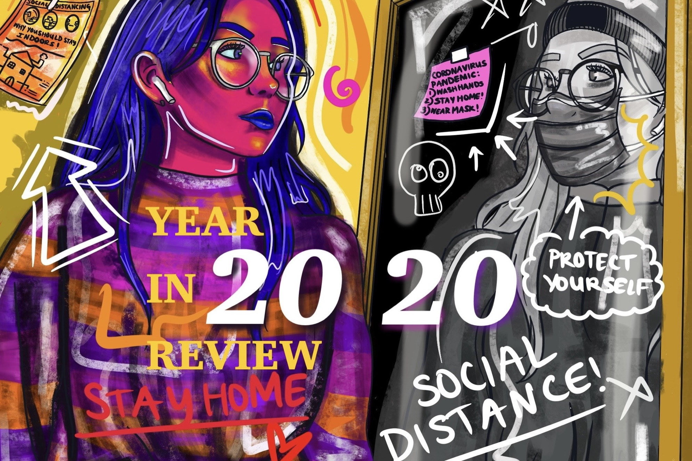

These chronicles was prepared by the author in his personal capacity.
The opinions expressed in this article are the author’s own and he hopes that his views do not serve as an inspiration to get writing yourself.
Some very long hours have been spent in their making. Please try to make it through.

### 2023, in a Nutshell
### 2022, in a Nutshell
### 2021, in a Nutshell
### 2020, in a Nutshell

<a href="#">
  

    
    

      <h2>2023, in a Nutshell</h2>
      
#4, a mix of recognition and surprise.

    

  

</a>

<a href="#">
  

    
    

      <h2>2022, in a Nutshell</h2>
      
#3, finally back to how things were.

    

  

</a>

<a href="#">
  

    
    

      <h2>2021, in a Nutshell</h2>
      
#2, expectations are the thief of joy.

    

  

</a>

<a href="#">
  

    
    

      <h2>2020, in a Nutshell</h2>
      
#1, welcome to the new normal.

    

  

</a>

